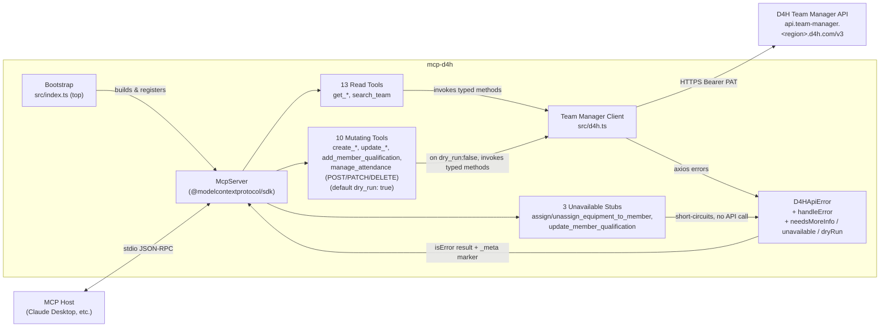
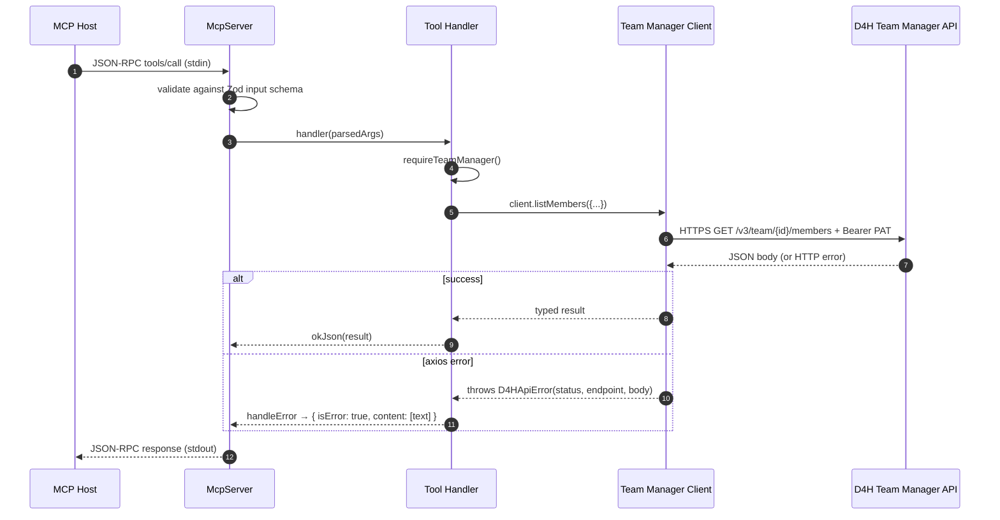
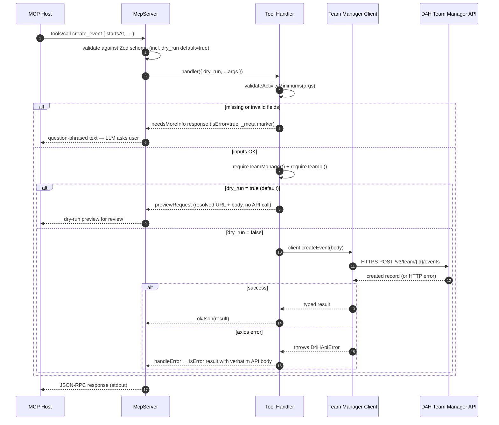

# Architecture

> This document describes the internal design of `mcp-d4h`: the components,
> the request lifecycle, the error model, and the security boundaries.

---

## 1. High-level picture

`mcp-d4h` is a thin, stateless bridge between an MCP host and the **D4H Team
Manager API** (spec version 7.0.1, URL prefix `/v3`). It owns no business
logic of its own — it just exposes well-typed tools that map 1:1 to D4H
endpoints.



**Wire protocol**: MCP JSON-RPC framed as one JSON message per line over
**stdin/stdout**.
**Outbound protocol**: plain HTTPS with `Authorization: Bearer <PAT>` —
exactly as documented in D4H's
[API Quick Start Guide](https://help.d4h.com/article/374-api-quick-start-guide).

There is no persistence layer, no shared state between tool calls, and no
background work. Every tool invocation is an isolated request/response.

---

## 2. Components

### 2.1 Bootstrap — top of [`src/index.ts`](../src/index.ts)

Responsibilities:

1. Load `.env` (if present) via `dotenv`.
2. Build the client from `process.env` using `buildClientsFromEnv`.
   - Missing credentials do **not** throw at startup — the client is simply
     left undefined.
   - Invalid `D4H_REGION` is fatal (process exits with a clear stderr message).
3. Log a one-line readiness summary to **stderr**:

   ```text
   [mcp-d4h] Region=US TeamManager=configured
   ```

4. Construct the `McpServer`, register the 26 tools (13 read + 10 mutating
   + 3 unavailable stubs), connect a `StdioServerTransport`.

### 2.2 Team Manager Client — [`src/d4h.ts`](../src/d4h.ts)

A thin axios wrapper around the Team Manager API at
`https://api.team-manager.<region>.d4h.com/v3`.

Design choices:

| Decision | Rationale |
|----------|-----------|
| One axios instance per client | Locks in `baseURL`, default headers, and timeout. No per-call header repetition. |
| Region-driven host resolution | `REGION_HOSTS` lookup, no string interpolation at call sites. |
| `D4HApiError` thrown on failure | Single error type carries `status`, `endpoint`, and a redacted body summary. |
| Permissive factory | `buildClientsFromEnv` returns an empty `clients.teamManager` when credentials are missing, never throws. |

### 2.3 MCP Server — middle of [`src/index.ts`](../src/index.ts)

Uses `McpServer.registerTool(name, config, handler)` from the official SDK
(v1.x). The tool layer has three kinds of handlers, sharing the same
registration shape but with different middleware:

**Read tools** (13) — `get_*` and `search_team`:

1. Declares a Zod input schema with `.describe()` on every field.
2. Calls `requireTeamManager()` → throws if client not configured.
3. Returns `okJson(data)` on success or `handleError(name, err)` on failure.

**Mutating tools** (10) — `create_*`, `update_*`, `add_member_qualification`,
`manage_attendance`:

1. Schema includes the shared `dryRunShape` (`dry_run: boolean`, default `true`).
2. Runs domain validation via `validateActivityMinimums` (activity creates)
   or `rejectIfNoUpdateFields` (updates). If anything is missing or invalid,
   short-circuits with **`needsMoreInfo`** — a question-phrased text response
   plus a machine-readable `_meta["mcp-d4h/needsMoreInfo"]` block. **No API
   call is made.**
3. If `dry_run` is true (default), builds a structured **`previewRequest`**
   response showing the exact resolved URL, method, and body that *would*
   be sent. No API call.
4. If `dry_run` is false, calls the corresponding client method and returns
   `okJson(data)` or `handleError`.

**Unavailable stubs** (3) — `assign_equipment_to_member`,
`unassign_equipment_from_member`, `update_member_qualification`:

1. Schema is declared for LLM discoverability (so it knows the tool exists
   and what it would take).
2. Handler immediately returns an **`unavailable`** response with
   `_meta["mcp-d4h/unavailable"] = true` and a precise reason pointing at
   the D4H web interface. **No API call is ever made.** Each stub was
   verified via live probing — `update_member_qualification` because the
   spec exposes no PATCH/PUT verb on `/member-qualification-awards`, and
   the equipment assign/unassign pair because PATCH `/equipment/{id}`
   rejects every variant of location/member/assignedTo fields with HTTP
   400 (the spec is in fact authoritative here).

All three response classes set `isError: true` if they refuse to act (so
hosts surface them visibly), and tag themselves via `_meta` with a
namespaced key (`mcp-d4h/...`) so structured hosts can differentiate.

### 2.4 Transport — bottom of [`src/index.ts`](../src/index.ts)

`StdioServerTransport` from
`@modelcontextprotocol/sdk/server/stdio.js`. No arguments, no configuration —
it owns the process's stdin/stdout for the MCP wire protocol.

---

## 3. Request lifecycle

A single tool invocation:



**Critical invariant**: every byte ever written to **stdout** is part of the
MCP wire protocol. Every log line goes to **stderr** via `console.error`.

### Mutating tool lifecycle (with `dry_run` and `needsMoreInfo`)



The unavailable-stub flow is even simpler: the handler skips every step
above and returns the `unavailable` response immediately after Zod
validation.

---

## 4. Error model

All errors funnel through a single shape so the LLM gets a uniform
explanation regardless of where the failure came from.

| Source | Class / Path | Surfaced as | `_meta` marker |
|--------|--------------|-------------|----------------|
| Missing credentials | `requireTeamManager()` throws `Error` | `isError: true`, `"Error: Unexpected error: Team Manager client is not configured. ..."` | — |
| HTTP non-2xx from D4H | `D4HApiError` | `isError: true`, `"Error: D4H API /team/12345/members failed (HTTP 401): {...}"` | — |
| Network / timeout | `D4HApiError` (no `status`) | `isError: true`, includes axios's message | — |
| Programmer bug | generic `Error` | `isError: true`, `"Error: Unexpected error: ..."` (also logged to stderr) | — |
| Schema validation | thrown by Zod inside SDK before handler runs | standard MCP JSON-RPC error reply | — |
| **Missing/invalid mutating input** | `validateActivityMinimums` / `rejectIfNoUpdateFields` | `isError: true`, question-phrased text — LLM relays as user prompt. No API call. | `mcp-d4h/needsMoreInfo: true` + structured `missing[]` / `invalid[]` |
| **Unavailable endpoint** | stub handler (e.g. PATCH `/member-qualification-awards` not in spec) | `isError: true`, reason text pointing at the D4H web interface. No API call. | `mcp-d4h/unavailable: true` + `specVersion` |
| **Dry-run preview** | `previewRequest` (mutating tools when `dry_run !== false`) | `isError: false` (not an error). JSON preview of the would-be request. No API call. | `mcp-d4h/dryRun: true` + resolved `preview` |

`D4HApiError` carries `status`, `endpoint`, and a **truncated** JSON summary
of the response body (max 500 chars) so error messages are useful without
dumping huge payloads at the LLM.

The three new `_meta`-tagged response classes (`needsMoreInfo`,
`unavailable`, `dryRun`) let MCP hosts that inspect `_meta` render them
distinctly (e.g. "needs your input" UI vs an actual error). Hosts that
only read `text` content fall back to the human-readable message.

---

## 5. Security model

| Concern | Mitigation |
|---------|-----------|
| Credential leakage | PAT read only from `process.env`. Never logged. Never appears in MCP responses. The redacted error body summary is truncated at 500 chars and is the response body, not the request headers. |
| Stdout corruption | All diagnostics go to stderr. Stdout is reserved for MCP framing. |
| Region misconfig | `D4H_REGION` is whitelisted (US/EU/CA). Anything else fails fast at boot. |
| TLS | All HTTP via `https://` — axios defaults to verifying CA certs. No insecure mode. |
| Input fuzzing from the LLM | Every tool input is validated by a Zod schema before the handler runs. Enums (`status`, etc.) are constrained. Pagination caps `size ≤ 100`. |

---

## 6. Region handling

Region resolution is done **once** at boot in
[`resolveRegion()`](../src/d4h.ts) and looked up in `REGION_HOSTS`:

```ts
const REGION_HOSTS: Record<D4HRegion, string> = {
  US: "api.team-manager.us.d4h.com",
  EU: "api.team-manager.eu.d4h.com",
  CA: "api.team-manager.ca.d4h.com",
};
```

To add a new region, extend the `D4HRegion` union and `REGION_HOSTS` map.
No other call sites need to change.

---

## 7. Extension points

| Need | Where to extend |
|------|-----------------|
| New D4H endpoint | Add a typed method to `TeamManagerClient` in `src/d4h.ts`. |
| New **read** MCP tool | Add `server.registerTool(...)` block in `src/index.ts` and a Zod schema. Reuse `okJson` / `handleError`. |
| New **mutating** MCP tool | Same as above plus: add `...dryRunShape` to the inputSchema; call domain validation before the `dry_run` branch; on `dry_run` true return `previewRequest(name, method, path, body)`; on `dry_run` false call the client and return `okJson`. |
| Tool that's known unsupported by API | Register schema for discoverability, handler immediately returns `unavailable(name, reason)`. |
| New region | Append to `REGION_HOSTS` + `D4HRegion` union. |
| Pagination helper | Wrap the client's list methods with an async iterator that follows the `totalSize`/`page` envelope. |
| Resource exposure (read-only MCP `resources/`) | Add `server.registerResource(...)` next to the tools — the SDK exposes the same factory pattern. |
| Prompt templates | Same pattern with `server.registerPrompt(...)`. |

See **[docs/development.md](./development.md)** for the step-by-step "add a
new tool" walkthrough.

---

## 8. What's intentionally NOT here

These are deliberate omissions, not oversights:

- **No retry / backoff.** D4H's rate limits are tenant-specific; the host
  layer (or a calling LLM agent) is a better place to decide on retries.
- **No response caching.** Tool calls are explicit user/LLM-driven actions;
  staleness risk outweighs the latency win.
- **No multiplexing across teams.** One server process = one team. If you
  need multi-team routing, run multiple `mcp-d4h` instances under different
  host entries (`d4h-team-a`, `d4h-team-b`, …).
- **No delete of tracked entities.** The server never issues DELETE for
  incidents, events, exercises, members, equipment, or qualifications — these
  are tracked records with audit implications. The sole exception is
  `manage_attendance` with `action: "remove"`, which DELETEs an attendance
  record. Attendance is an **edge** (a join between a member and an
  activity), not an entity; removing it edits the activity's roster without
  deleting the member or the activity. This is the only DELETE in the server.
- **No streaming results.** All tool results are returned as a single JSON
  payload. The MCP `text` content model fits that naturally.
